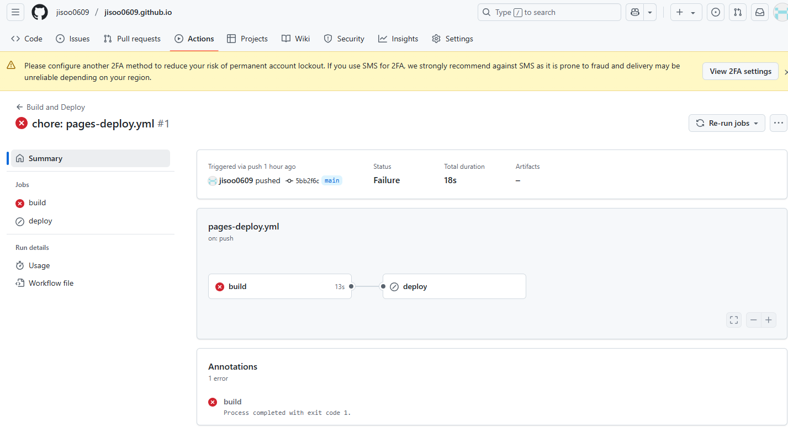

# Jekyll Blog
기존의 블로그 테마에서 카테고리가 존재하는 테마로 변경하려고 새 테마를 찾았다.

사람들이 많이 찾는 [chirpy](https://github.com/cotes2020/jekyll-theme-chirpy) 테마로 변경하려고 했다.

fork 해서 만들면 좋지만 나는 기존의 블로그가 존재하기 때문에 기존 레포지토리에서 테마만 바꾸려는 방법을 선택했다.

## Upload
먼저 ruby를 설치하고 로컬에 jekyll serve 띄우기까지는 성공했다.

local에선 무리없이 보이는 내용들이여서, git에 올려도 그대로 deploy될 줄 알았다.


## Trouble Shooting
### 첫번째 시도
위의 에러문구가 신경쓰여서 확인해보니 Node.js 기반 프로젝트에서 에서 자주 사용하는 패키지 설치 및 빌드가 필요했다.
```
npm install
```
```
npm run build
```
해당 과정으로 로컬에서는 해결


추가로 `assets/js/dist/` 디렉토리 확인해보라고 해서 위 경로에 `theme.min.js`, `home.min.js` 등의 파일이 존재하는지도 확인했다..

문제 없이 GitHub Actions 가 돌아갈줄 알았으나..

### 두번째 시도

여전히 뜨지 않았다..

해당 문제를 찾아보니 
```GitHub Actions는 리눅스 환경에서 워크플로우를 실행하기 때문에, Gemfile.lock에 x86_64-linux 플랫폼이 누락되어 있으면 필요한 gem들을 설치할 수 없다``` 길래 `Gemfile.lock`에 리눅스 플랫폼 추가를 시도했다.
```
bundle lock --add-platform x86_64-linux
```
별 착오는 없었다..

### 세번째 시도
gpt와 구글링을 병행하며 수정하라는 부분을 수정했는데 이번에는 Actions에서 deploy 자체가 되고 있지 않았다.

해당 문제는 `pages-deploy.yml`이 `/wokflows/`에 있는게 아니라 `/workflows/starter/` 아래 있어서 실행되지 않은것 같다.

`pages-deploy.yml`을 `/workflows/`로 이동시켜주었다.

이동시키고 나니 n시간만에 에러 로그가 보이는 deploy가 나타났다.


```
Run bundle exec jekyll b -d "_site"
```

이 과정에서 에러가 나는걸 n시간 만에 발견....

## 해결
```
Run bundle exec jekyll b -d "_site"
```


이 부분은 부트스트랩이 추가되어있지 않아서 발생하는 문제였다.

에러 메시지 보면 `@use 'vendors/bootstrap';` 하는데 부트스트랩 SCSS 파일이 없어서 실패하고 있었다.

로컬 `assets/css/vendors/_bootstrap.scss`에 `_bootstrap.sccs`이 있었는데 해당 파일이 `.gitignore`에 제외되어있던 것 같다.
해당 파일을 깃에 추가했더니 해당 스텝은 통과되었다.

다음 스텝에서 또 다시 에러가 발생했다.
```
 internal script reference /assets/js/dist/theme.min.js does not exist
```

맨 처음에 봤던 에러다.

`deploy`할 때 `npm run build`가 필요하다.
그래야 빌드된 `JS/CSS` 파일들이 `_site/assets/js/dist/`에 생성되어 배포된 사이트에 필요한 파일이 포함된다.

`page-deploy.yml` 안에 `npm instal`l + `npm run build`를 추가한다.
```yaml
- name: Setup Node
  uses: actions/setup-node@v4
  with:
    node-version: lts/*

- name: Install and Build JS Assets
  run: npm install && npm run build
```

빌드 과정이 문제 없이 진행된다.

블로그도 문제 없이 접근 가능하다.
